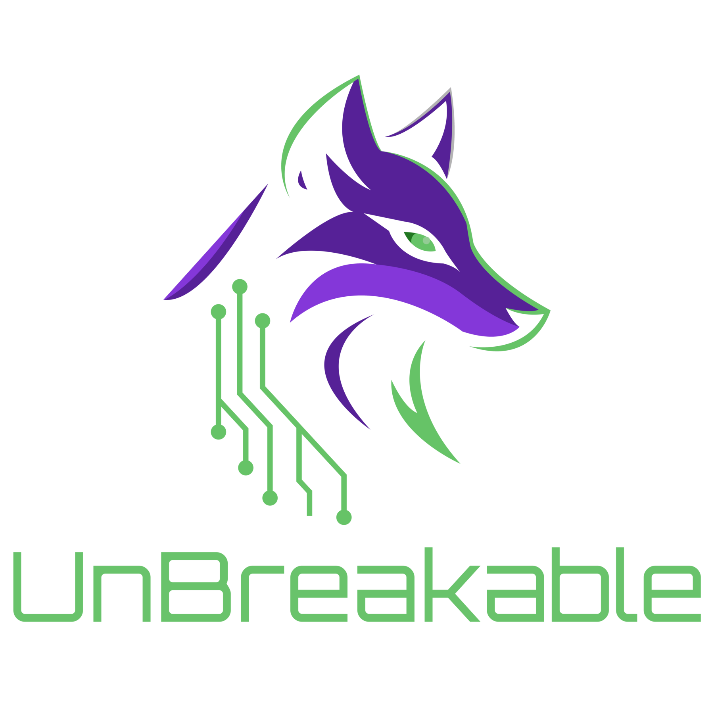
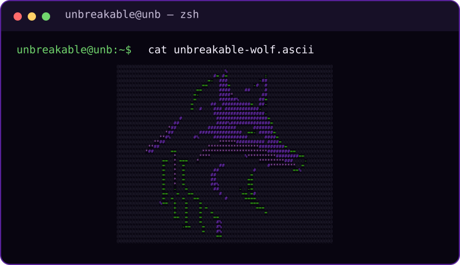

  

<h1 align="center">Segurança ofensiva se aprende fazendo.</h1>

  Grupo de estudos da <strong>Universidade de Brasília</strong> dedicado a transformar curiosidade em repertório técnico aplicável.

  
  
  
  

---

## Uma matilha para quem quer ir além da teoria.

  

Máquina por máquina, write-up por write-up, reunimos alunos da UnB para investigar, explorar e competir com método. No UnBreakable, prática, troca e documentação caminham juntas.

> O ataque termina no write-up.

## O que movemos

- Prática guiada em laboratórios e máquinas reais.
- Estudos de CTF, reconhecimento, exploração de vulnerabilidades e escalonamento de privilégios.
- Discussões sobre técnicas, decisões e caminhos possíveis.
- Write-ups para transformar descobertas em conhecimento reproduzível.
- Palestras, oficinas e competições que ampliam a comunidade.

## Nosso campo de estudo

  
  
  
  

## Acompanhe a matilha

- [LinkedIn](https://www.linkedin.com/company/unbreakable-project) — atualizações e informações sobre o grupo.
- [Instagram](https://www.instagram.com/unbreakableunb/) — agenda, atividades e notícias.
- [TikTok](https://www.tiktok.com/@unbreakableunb) — conteúdo curto sobre nossa rotina.
- [YouTube](https://www.youtube.com/@unbreakableunb) — canal oficial.

## Quer fazer parte?

A porta de entrada é a disciplina **Tópicos Avançados em Computadores**, da Universidade de Brasília. Para atividades abertas, acompanhe nossas redes.

  UnBreakable · Universidade de Brasília

